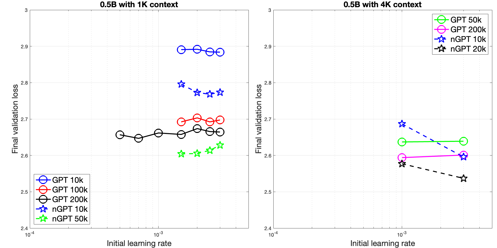

Copyright(c) 2024 NVIDIA CORPORATION & AFFILIATES. All rights reserved.
 
MIT License
[https://opensource.org/license/mit](https://opensource.org/license/mit)

Permission is hereby granted, free of charge, to any person obtaining a
copy of this software and associated documentation files (the "Software"),
to deal in the Software without restriction, including without limitation
the rights to use, copy, modify, merge, publish, distribute, sublicense,
and/or sell copies of the Software, and to permit persons to whom the
Software is furnished to do so, subject to the following conditions:

The above copyright notice and this permission notice shall be included in
all copies or substantial portions of the Software.

THE SOFTWARE IS PROVIDED "AS IS", WITHOUT WARRANTY OF ANY KIND, EXPRESS OR
IMPLIED, INCLUDING BUT NOT LIMITED TO THE WARRANTIES OF MERCHANTABILITY,
FITNESS FOR A PARTICULAR PURPOSE AND NONINFRINGEMENT. IN NO EVENT SHALL
THE AUTHORS OR COPYRIGHT HOLDERS BE LIABLE FOR ANY CLAIM, DAMAGES OR OTHER
LIABILITY, WHETHER IN AN ACTION OF CONTRACT, TORT OR OTHERWISE, ARISING
FROM, OUT OF OR IN CONNECTION WITH THE SOFTWARE OR THE USE OR OTHER
DEALINGS IN THE SOFTWARE.

Please take a moment to read this text in full. It may save you time.

# **nGPT: Normalized Transformer with Representation Learning on the Hypersphere**

**Authors**: Ilya Loshchilov, Cheng-Ping Hsieh, Simeng Sun, and Boris Ginsburg  
**Paper**: [arXiv:2410.01131](https://arxiv.org/abs/2410.01131)

---

This repository provides code for **nGPT**, which builds on **nanoGPT** by Andrej Karpathy. Familiarity with nanoGPT's codebase is **required**, as it resolves common issues relevant here. With this foundation, you’ll find using and understanding nGPT much easier.

## **Project Overview**

The main difference in this codebase lies in the Transformer models:

1. **Modifications**: 
   - `model.py` includes both the **original** and **normalized Transformer** models.
   - `train.py` contains the **normalization procedure** for training.
   - The architecture follows the paper's specifications. The vocabulary size is different and this changes the scale of loss values. 

2. **Dependencies**:
   - **nanoGPT**: To generate the data folder with OpenWebText, see the [nanoGPT repository](https://github.com/karpathy/nanoGPT).
   - **FlashAttention**: FlashAttention from [Dao-AILab](https://github.com/Dao-AILab/flash-attention) (BSD 3-Clause License) is used, though PyTorch’s default attention can be substituted if preferred.

## **Getting Started**

### **Running the Code**

To start the training process with defined hyperparameters, execute `launcher.sh`.

### **Experiment Replication**

The paper demonstrates a speedup of nGPT w.r.t. the baseline GPT in three settings: 1k, 4k and 8k context length. For 1k context length, **the expected speedup is of a factor of 4 at about 200k iteration steps** of training (i.e., the validation loss if on par with the one of the baseline GPT after 800k steps). **For shorter training runs, the expected speedup is smaller**. For 4k context length, the expected speedup is of a factor of 10. Similarly, the longer the training the greater the speedup.

When reproducing these experiments using nanoGPT codebase, we introduced a few modifications to reflect the experimental setup used in the paper. First, we use RoPE for positional embedding instead of the absolution positional embedding. Second, we use SwiGLU instead of GELU which was the default in nanoGPT. Third, the original nanoGPT code can perform operations using lower-precision arithmetic (e.g., with bfloat16), however, the storage of parameters is happening in float32. In order to reflect our experimental setup of the paper where parameters of matrices are in bfloat16, we also set bfloat16 as the dtype of network parameters (all except embeddings). Apparatently, the change from float32 to bfloat16 only moderately affects nGPT but greatly degrades performance of the baseline GPT. In fact, the speedups that we observe in this reimplementation are greater than the ones of our internal experiments. This suggests that the treatment of precision-critical operations in this code is rather suboptimal and this affects the baseline GPT much more. Thus, **the demonstrated here speedup factors are greater than they normally should be and reported in the paper**. One possible explanation could be that nGPT is less sensitive to low-precision arithmetic/storage than the baseline GPT. As a result, one could see a smaller speedup when using float32 precision and a greater speedup when using bfloat16 and even lower precision. However, it also could be that something is wrong in this implementation. We would love to iterate over this code to make it a better approximation of our internal experiments and overall to attain a reproducible experimental setup. 

---

---

### **Repository Goals**

Like nanoGPT, it might be beneficial to keep this code stable (with fixing only bugs) so that it can serve as a consistent reference implementation. 

This implementation is not optimized for memory or compute performance: the main goal is to **_illustrate_** how nGPT works, not to achieve a production-ready code. The paper suggests that nGPT can be simplified in various ways, sometimes without any loss in performance.

**Special Thanks**: Many thanks to Andrej Karpathy for creating the nanoGPT library, which serves as a foundational component of this project.

---

